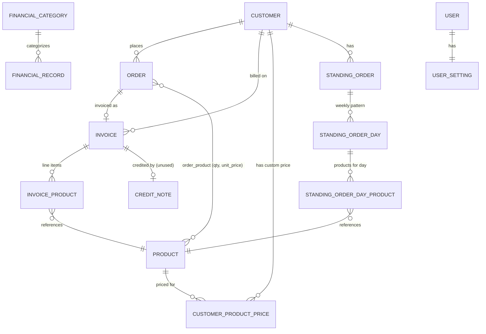

# NutiPita Admin — Pre-Refactor Codebase Analysis

Analysis pass ahead of a planned refactor into a domain / repository / service / query-class architecture. This is an inventory and readiness assessment only — no new class names or file structures are proposed here.

Stack: Laravel 11 (`^8.5` PHP), Livewire 3 (`livewire/flux` UI kit), `barryvdh/laravel-dompdf`, no API/queue-driven architecture in evidence (synchronous, session/web-only app).

---

## 1. Business model overview

NutiPita is an **order → invoice management system for a food/produce distributor** that sells products to business customers on a recurring (standing order) or ad-hoc basis, tracks per-customer pricing, generates PDF invoices from delivered orders, and separately tracks general financial income/expense records (a lightweight bookkeeping module) alongside credit notes.

### Core workflows

1. **Order lifecycle**: An order is created for a `Customer` with one or more `Product` line items (qty + unit price captured on the pivot at creation time). Orders carry a `day`/`night` shift flag (`is_daytime`) and a due date (`order_due_at`). Orders progress through a status: `Y_CONFIRMED` (created) → `O_DELIVERED_UNPAID` (invoiced) → `G_PAID` (payment received), with status changes currently done via unchecked writes (see §5) rather than a validated state machine.
2. **Standing orders**: A `StandingOrder` per customer defines a recurring weekly pattern (`StandingOrderDay` × `StandingOrderDayProduct`, qty per product per weekday). A scheduled console command (`CreateOrderFromStanding`, runs daily 00:02) materializes a concrete `Order` from the matching day's standing-order template; a second command (`CheckForStandingOrdersToBeActivated`, runs daily 00:01) auto-activates standing orders whose `start_from` date has arrived, unless manually force-overridden (`is_forced`).
3. **Invoicing**: An `Invoice` is generated either from a single `Order` (`InvoiceController::createSingleInvoice`) or from a date-range of a customer's orders ("auto" mode) or manually-entered line items ("manual" mode) via the `Invoice/CreateInvoice` Livewire component. Invoicing snapshots order/product data into `InvoiceProduct` rows, computes a total, generates a PDF (stored on disk, path recorded on the invoice), and transitions the source order(s) to `O_DELIVERED_UNPAID`. Deleting an invoice reverts the order back to `Y_CONFIRMED`.
4. **Credit notes**: `CreditNote` exists as a table/model tied 1:1 to an `Invoice`, but the only code referencing it (`CreditNoteController::test`) is a hardcoded, non-persisting PDF prototype — this workflow is effectively unimplemented.
5. **Financial records**: A parallel, order-independent bookkeeping feature — `FinancialRecord` (income/expense line items, categorized via `FinancialCategory`) with CSV bank-statement import (`FinRecord/FileImport`).
6. **Customer-specific pricing**: `CustomerProductPrice` overrides a product's price per customer; `Product::price` (an accessor) resolves the effective price for "the current customer" via request-scoped state set on the model (see §3, flagged as fat-model logic).
7. **User settings**: per-user UI preferences (color mode, theme, font size) — cosmetic, not core domain.

### Entity relationships



Plain-list version (FK direction, per model files):

| Parent | Relation | Child | FK |
|---|---|---|---|
| Customer | hasMany | Order | `orders.customer_id` (nullable, `set null` on delete) |
| Customer | hasMany | Invoice | `invoices.customer_id` |
| Customer | hasMany | CustomerProductPrice | `customer_product_prices.customer_id` (nullable) |
| Customer | hasMany | StandingOrder | `standing_orders.customer_id` |
| Product | belongsToMany | Order (via `order_product`) | pivot: `product_qty`, `order_product_unit_price` |
| Product | hasMany | CustomerProductPrice | `customer_product_prices.product_id` |
| Order | hasOne | Invoice | `invoices.order_id` (nullable, `null on delete`) |
| Invoice | hasMany | InvoiceProduct | `invoice_products.invoice_id` (cascade delete) |
| Invoice | hasOne | CreditNote | `credit_notes.invoice_id` |
| StandingOrder | hasMany | StandingOrderDay | `standing_order_days.standing_order_id` |
| StandingOrderDay | hasMany | StandingOrderDayProduct | `standing_order_day_products.standing_order_day_id` |
| FinancialCategory | (inverse only) | FinancialRecord | `financial_records.fin_cat_id` (nullable, `set null`) |
| User | hasOne | UserSetting | `user_settings.user_id` (PK = FK, cascade) |

---

## 2. Current architecture

### Directory overview (business-relevant subset)

```
app/
├── Console/Commands/        (2 scheduled jobs: standing-order activation & materialization)
├── DataTransferObjects/     InvoiceDto, InvoiceProductDto, OrderSummaryDto, ProductTotalDto
├── Enums/                   OrderStatus, InvoiceStatus, FinancialRecordType, settings/*
├── Helpers/                 Format, ModelResolver, helpers.php (global fn wrappers + Blade directives)
├── Http/Controllers/        12 controllers, thin/CRUD except Order & StandingOrder (fat)
├── Http/Requests/           10 FormRequests, validation-only
├── Livewire/                31 components — where most business logic + queries actually live
├── Models/                  14 Eloquent models + 1 global Scope class
├── Providers/AppServiceProvider.php
├── Queries/OrderQueryBuilder.php   (only existing query-class; Order-only, under-adopted)
├── Services/                OrderService, InvoiceService, LivewireHelpers/OrderListService
└── Traits/                  HasSort, HasQuickDueFilter, TestableRenderComponent (dead)
```

### Which layer holds business logic today

Business logic is **scattered across four layers with heavy duplication between them**, not concentrated in any one place:

| Layer | Role today |
|---|---|
| **Livewire components** (`app/Livewire/**`) | The primary layer — most list/filter/CRUD/query logic lives here. Components build Eloquent queries inline (`InvoiceList::render()`, `FinancialRecordList::buildQuery()`, `StandingOrderList::render()`), and several call `Services` correctly (`OrderService`, `InvoiceService`) while others don't (there's no consistent rule for when a component uses a service vs. queries directly). |
| **Controllers** (`app/Http/Controllers`) | Mostly thin CRUD wrappers around a single model's `create`/`update`, **except** `OrderController` and `StandingOrderController`, which contain substantial inline business logic that **duplicates and diverges from** `OrderService` (see §5) and has no service counterpart at all for standing orders. |
| **Models** | Contain real business logic beyond mapping in `Product` (customer-scoped pricing), `Order` (financial aggregation, presentation formatting, and status-mutating "scopes"), and `Invoice` (invoice-number generation) — see §3. |
| **Services** | Only 2 real domain services exist (`OrderService`, `InvoiceService`), each covering only part of their domain — both are bypassed by at least one other code path performing the same operation independently (see §5). |

**Where logic is duplicated or scattered (headline examples, full detail in later sections):**
- Order create/update/delete logic exists in **three independent places**: `OrderService`, `OrderController` (diverged — see the `is_standing` flag bug in §5), and `Console/Commands/CreateOrderFromStanding`.
- "Products with custom price for a customer" query is copy-pasted **4 times** (`Modal/OrderCreate`, `Modal/OrderEdit`, `Product/ProductSelector`, `StandingOrder/CreateStandingOrder`), one of which is missing a call the other three have (a real behavioral inconsistency, not just style).
- Order date/shift/customer filter logic is reimplemented **at least 6 times** outside the one `OrderQueryBuilder` that exists for exactly this purpose (`OrderService::createBasicSummary`, `MoneyFilter`, `HomepageOrders`, `Invoice/CreateInvoice`, `_discard/CreateInvoiceFromOrder`, `CustomerController::show`).
- Standing-order activation rules are implemented independently in **three places**: `StandingOrderController::store`, `StandingOrderController::update` (the `is_forced` flag), and `CheckForStandingOrdersToBeActivated`.
- Customer custom-price upsert logic is duplicated between `CustomerController::update` and `CustomerController::updateCustomPrice`.

### Livewire component inventory

31 components total. Full per-component breakdown (properties, methods, direct model access) is extensive — condensed summary:

| Component | Responsibility | Direct model access | Calls a Service? |
|---|---|---|---|
| Customer/CustomerList | List customers (sorted), preload custom-price products | Customer, Product | No |
| Customer/CustomerPopupCard | Customer detail card (read-only) | Customer | No |
| Customer/MobileCustomerSort | Dispatch mobile sort → CustomerList | — | No |
| CustomerCustomPrices | Manage a customer's custom product prices | Customer, CustomerProductPrice | No |
| FinCategories/FinancialCategoryList | List/delete financial categories | FinancialCategory | No |
| FinRecord/FileImport | CSV import of financial records | FinancialRecord | No |
| FinRecord/FinancialRecordFilter | Filter state + dispatch to list/toggler | FinancialCategory | No |
| FinRecord/FinancialRecordList | List/delete financial records (in-component query) | FinancialRecord | No |
| FinRecord/FinancialRecordToggler | UI toggle relay (income/expense) | — | No |
| Homepage/DownloadSummary | Build & redirect to order summary PDF | — | Yes (OrderService) |
| Homepage/HomepageOrders | Existence checks for day/night orders | Order | No |
| Homepage/HomepageToggler | UI toggle → dispatch to HomepageOrders | — | No |
| Invoice/CreateInvoice | Create invoice (auto/manual modes) — most complex component in the app | Customer, Product, Order, Invoice | Yes (InvoiceService) |
| Invoice/InvoiceFilter | Filter state + dispatch to InvoiceList | Customer | No |
| Invoice/InvoiceList | List/paginate/status-update/delete invoices (in-component query) | Invoice, Order | No |
| Invoice/InvoicePopupCard | Invoice detail card + delete | Invoice | Yes (InvoiceService) |
| Invoice/MobileInvoiceSort | Dispatch mobile sort → InvoiceList | — | No |
| Modal/ModalContainer | Global modal stack manager | — | No |
| Modal/OrderCreate | Order creation modal form | Product | Yes (OrderService) |
| Modal/OrderEdit | Order edit modal form | Order, Product | Yes (OrderService) |
| **MoneyFilter** | **Dead/unused** order-income filter widget (not embedded anywhere) | Order, Customer | No |
| Order/MobileOrderSort | Dispatch mobile sort → OrderList | — | No |
| Order/OrderFilter | Filter state + dispatch to OrderList | — | No |
| Order/OrderPopupCard | Order detail card + delete/edit/invoice actions | Order | Yes (OrderService) |
| Order/OrderSummary | Aggregate summary (count/income/product totals) | Order (via OrderQueryBuilder) | No (uses query class — the model to generalize) |
| OrderList | Main order list, desktop+mobile, pagination/sort/filter | Order, Product | Uses OrderQueryBuilder + OrderListService |
| OrderSummaryDownload | Relay download-link event to UI | — | No |
| Product/MobileProductSort | Dispatch mobile sort → ProductList | — | No |
| Product/ProductList | List products (sorted) | Product | No |
| Product/ProductSelector | Product picker for a chosen customer | Customer, Product | No |
| Setting/AppearanceUpdateForm | User appearance/theme settings form | User (settings relation) | No |
| StandingOrder/CreateStandingOrder | Standing order creation form (product list) | Product | No |
| StandingOrder/MobileStandingOrderSort | Dispatch mobile sort → StandingOrderList | — | No |
| StandingOrderList | List/toggle-status/delete standing orders (manual cascade delete) | StandingOrder (+ days/day-products) | No |
| **_discard/CreateInvoiceFromOrder** | **Dead/unused** — superseded draft of CreateInvoice | Order | Yes (InvoiceService) |

**Dead code to exclude from the refactor migration:** `MoneyFilter.php` (zero references in any Blade view or route) and `_discard/CreateInvoiceFromOrder.php` (folder name signals intentional discard, zero references, logic superseded by `Invoice/CreateInvoice`'s `formMode` toggle). The `TestableRenderComponent` trait is also unused by any component.

**Recurring structural duplication across components** (concrete evidence, not just a pattern name):
- **5 `Mobile*Sort` components** (`Customer`, `Invoice`, `Order`, `Product`, `StandingOrder`) are ~15-line classes whose entire body is identical except the target list class and view name — the receiving side is already shared via `HasSort`'s `#[On('set-mobile-sort')]` listener, so only the dispatcher side remains duplicated.
- **4 `*Filter` components** (`OrderFilter`, `InvoiceFilter`, `FinancialRecordFilter`, dead `MoneyFilter`) share the same "hold filter state → `updated()` hook → local `dispatchEvent()` → targeted/untargeted `update-filter` dispatch" shape, but with inconsistent field names (`due_from/due_to` vs `invoice_from/invoice_to`) — evidence the pattern was copy-pasted rather than shared.
- **3 `*PopupCard` components** share a "single-record lookup + eager load + modal-backing" shape but diverge in capability (`CustomerPopupCard` is read-only; `InvoicePopupCard`/`OrderPopupCard` both delegate delete to a service and dispatch `modal-clear`+`refresh`, but only `OrderPopupCard` has extra `createInvoice()`/`editOrder()` actions and a self-`#[On('refresh')]` listener).
- **Join-based "sort by customer name" closures** appear independently in `InvoiceList::customSorts()`, `StandingOrderList::render()` (inline), and `OrderListService::customSorts()['customer']` — same `join(customers)…orderBy(customer_name)` shape, 3 separate implementations, only one of which lives in a Service.

### Existing service-like classes

| Class | Covers | Does NOT cover |
|---|---|---|
| `app/Services/OrderService.php` | `createBasicSummary()`, `createOrder()`, `updateOrder()`, `deleteOrder()` — but only reached from **Livewire** call sites (`Modal/OrderCreate`, `Modal/OrderEdit`, `Order/OrderPopupCard`, `Homepage/DownloadSummary`) | `OrderController::store`/`update` reimplement create/update inline instead of calling it (and have diverged — see §5); `OrderList::deleteOrder`/`updateOrderStatus` reimplement delete/status-update inline instead of calling it; `CreateOrderFromStanding` console command reimplements order creation independently; order-query filter logic used by `createBasicSummary` duplicates (with variations) `OrderQueryBuilder` instead of reusing it. |
| `app/Services/InvoiceService.php` | `generateInvoice()`, `generateInvoiceProductDTOs()`, `generateInvoiceProductRecords()`, `generateInvoicePdfFromDtos()`, `deleteInvoice()` (called from `InvoiceController::createSingleInvoice`, `Invoice/CreateInvoice`, `Invoice/InvoicePopupCard`, dead `_discard/CreateInvoiceFromOrder`) | Invoice-total calculation for the single-invoice path is done inline in `InvoiceController::createSingleInvoice` (`:55-57`), not in the service; the forward order-status transition to `O_DELIVERED_UNPAID` on invoice creation lives in the controller, while only the reverse transition (`Y_CONFIRMED` on delete) lives in the service — an asymmetric, split status machine. Multi-order/date-range invoice-eligible-order querying is done independently in `Invoice/CreateInvoice` rather than centralized. |
| `app/Services/LivewireHelpers/OrderListService.php` | Custom sort closures (`customer`/`total_pita`/`total_price`) + `getOrderSummaryPdfUrl()` | Filter-building (that's `OrderQueryBuilder`'s job) and summary aggregation (duplicated again, separately, in `Order/OrderSummary::calculateSummaries`, which writes its own raw join/selectRaw rather than reusing this class's join logic). |
| `app/Queries/OrderQueryBuilder.php` | Centralizes Order filtering by `active_period`/`daytime_only`/`nighttime_only`/`customer_id`/`status`/`due_from`/`due_to` — consumed by `OrderList` and `Order/OrderSummary` only | No equivalent exists for Invoice, FinancialRecord, or StandingOrder — each of those builds its filter query inline in its own Livewire component instead. |

**Notably absent:** no `StandingOrderService`, no `CustomerPriceService`, no `FinancialRecordService`, no query-class for any model besides `Order`.

---

## 3. Models

14 Eloquent models + 1 global `Scope` class (`app/Models/Scopes/Product/SortByName.php`). No Observers exist anywhere in the app; the only model-lifecycle hook is `Product::booted()` registering the global sort scope.

**⚠️ Cross-cutting gap:** Three enum-backed status/type columns — `orders.order_status` (`OrderStatus`), `invoices.invoice_status` (`InvoiceStatus`), `financial_records.fin_record_type` (`FinancialRecordType`) — are **not** cast to their PHP enums in Eloquent (treated as raw strings, with manual mapping via accessors/`fromName()`). Only `UserSetting` correctly casts its three int-enum columns via `casts()`. This inconsistency is a natural cleanup item once query/repository classes are introduced.

| Model | Table | Relationships | Notable logic | Verdict |
|---|---|---|---|---|
| `Customer` | `customers` (PK `customer_id`) | hasMany Order, CustomerProductPrice, Invoice | `getShortAddressAttribute()` — string concat, ignores 2 of 5 address columns (stale accessor) | **Thin** |
| `Product` | `products` (PK `product_id`) | belongsToMany Order (pivot `product_qty`, `order_product_unit_price`), hasMany CustomerProductPrice | Global scope `SortByName` (always `orderByDesc(product_name)`, hidden ordering); `setCurrentCustomer()`/`$currentCustomer` — non-persisted in-memory state; `scopeForCustomer()` doesn't filter at all, instead registers an `afterQuery` callback that mutates hydrated results (side-effecting "scope"); `getPriceAttribute()` calls `abort(418, …)` if no customer context set — HTTP concern inside a model accessor | **Fat** — highest-priority extraction target (customer-scoped pricing resolution) |
| `Order` | `orders` (PK `order_id`) | belongsTo Customer, belongsToMany Product, hasOne Invoice | `getTotalPitaAttribute()`/`getTotalPriceAttribute()` (PHP-side pivot aggregation), `getTotalPriceFormatAttribute()`/`getPlacedAtAttribute()` (presentation formatting in the model), `getStatusAttribute()` (duplicates enum-label mapping), `getTotalOfProduct()` (has a dead-code guard — `Collection::where()` never returns falsy), `scopeForInvoice()` (couples Order directly to Invoice fields), `scopeMarkPaid()`/`scopeMarkUnpaid()`/`scopeMarkConfirmed()` — **bulk-update writes disguised as query scopes** | **Fat** — richest business logic in the app |
| `Invoice` | `invoices` (PK `invoice_id`) | belongsTo Customer, belongsTo Order, hasMany InvoiceProduct, hasOne CreditNote | `static getNextInvoiceNumber()` — live query + zero-padded increment algorithm inside the model; **not concurrency-safe** (TOCTOU race if two invoices generated simultaneously) | **Fat** |
| `InvoiceProduct` | `invoice_products` (composite PK, no timestamps) | belongsTo Invoice, belongsTo Product | none | Thin |
| `CreditNote` | `credit_notes` | belongsTo Invoice | none (feature effectively unimplemented — see §1) | Thin |
| `CustomerProductPrice` | `customer_product_prices` | belongsTo Product, belongsTo Customer | none (all pricing logic lives on `Product`, not here) | Thin |
| `StandingOrder` | `standing_orders` | hasMany StandingOrderDay, belongsTo Customer | none — despite `is_active`/`is_forced`/`start_from` implying scheduling logic, none exists on the model (it's scattered across `StandingOrderController` + 2 console commands instead, see §5) | Thin (but logic gap) |
| `StandingOrderDay` | `standing_order_days` | belongsTo StandingOrder (method named `order()` — misleading, doesn't return an `Order`), hasMany StandingOrderDayProduct | naming inconsistency only | Thin |
| `StandingOrderDayProduct` | `standing_order_day_products` | belongsTo StandingOrderDay, **`hasOne(Product::class, …)`** (should semantically be `belongsTo` — relation-type modeling bug, functionally works today but risky under `save()`/inverse-eager-load assumptions) | relationship-type bug | Thin |
| `FinancialCategory` | `financial_categories` (no timestamps) | none defined (no inverse `hasMany` to FinancialRecord) | none | Thin |
| `FinancialRecord` | `financial_records` | belongsTo FinancialCategory | none | Thin |
| `User` | `users` (PK `user_id`) | hasOne UserSetting | standard Authenticatable, `casts()` hashes password | Thin |
| `UserSetting` | `user_settings` (PK = FK `user_id`, no timestamps) | belongsTo User | Only model with proper enum `casts()` | Thin |

**Fat models ranked:** `Product` > `Order` > `Invoice`. These three concentrate essentially all of the app's model-layer business logic and are the natural first candidates when defining domain boundaries.

---

## 4. Data access patterns

### Where queries are built today

- **Centralized (partially):** `app/Queries/OrderQueryBuilder.php` — the only dedicated query class in the codebase. Handles Order date/shift/customer/status filtering. Used by only 2 of ~7+ call sites that need equivalent Order filtering.
- **Livewire components (majority of query logic):** `InvoiceList::render()`, `FinancialRecordList::buildQuery()`, `StandingOrderList::render()`, `CustomerList::render()`, `ProductList::render()`, `HomepageOrders::mount()`, `MoneyFilter::loadOrderData()` (dead), and the 4 duplicated "products with custom price" queries all build Eloquent chains inline in the component.
- **Controllers:** `CustomerController` (show/edit/update/editCustomPrice/updateCustomPrice all build Product/CustomerProductPrice queries inline), `OrderController` (store/update/createSummaryPdf all inline, duplicating `OrderService`), `StandingOrderController` (store/update/show/edit all inline, no service at all).
- **DTOs:** `InvoiceDto::from()` embeds a live uniqueness-check query (`Invoice::where('invoice_number', ...)->exists()`) inside what should be a pure data-mapping factory.

### Repeated/duplicated query logic (concrete instances)

| Pattern | Call sites | Notes |
|---|---|---|
| Order date/shift/customer filter | `OrderQueryBuilder::build()`, `OrderService::createBasicSummary()`, `MoneyFilter::loadOrderData()`, `HomepageOrders::mount()`, `Invoice/CreateInvoice` (2 spots), `_discard/CreateInvoiceFromOrder`, `CustomerController::show` | At least 6 reimplementations outside the one builder meant to own this; `HomepageOrders` and `OrderQueryBuilder`'s `active_period==='today'` branch express "due today/tomorrow" with different literal-date logic — can drift out of sync silently. |
| "Products with custom price for customer X" | `Modal/OrderCreate::render()`, `Modal/OrderEdit::render()`, `Product/ProductSelector::render()`, `StandingOrder/CreateStandingOrder::render()` | 4 copies; the `CreateStandingOrder` copy is missing the `->forCustomer()` call the other 3 have — an actual functional gap, not just style. |
| "Join customers, order by customer_name" | `InvoiceList::customSorts()`, `StandingOrderList::render()` (inline), `OrderListService::customSorts()['customer']` | 3 copies of the same join/orderBy shape. |
| Customer custom-price upsert | `CustomerController::update()`, `CustomerController::updateCustomPrice()` | Same `CustomerProductPrice::updateOrCreate` pattern duplicated within the same file. |
| Order creation (full flow: validate qty>0 → transaction → create → attach products with pricing) | `OrderService::createOrder()`, `OrderController::store()`, `CreateOrderFromStanding::handle()` | 3 independent implementations; controller and command never call the service. |
| Order summary/aggregation ("sum product qty × price across a set of orders") | `OrderSummaryDto::from()`, `OrderService::createBasicSummary()`, `OrderController::createSummaryPdf()` (raw arrays), `Order/OrderSummary::calculateSummaries()` (raw SQL), `MoneyFilter::loadOrderData()` (PHP-side `chunk()` loop) | 5 variations of "total up orders' product qty/price," none sharing an implementation. |
| Standing-order activation state machine | `StandingOrderController::store()`, `StandingOrderController::update()` (`is_forced` flag), `CheckForStandingOrdersToBeActivated::handle()` | Rules for `is_active`/`is_forced`/`start_from` expressed independently in all three. |

### N+1 risks / missing eager loading noticed

- `CustomerController::edit()` — `Product::all()->map(fn($p) => $p->setCurrentCustomer($customer))` then presumably accesses `->price` per product in the view, which internally accesses `$this->customPrices` per product; without eager-loading `customPrices` on the `all()` call this is an N+1 (one query per product to resolve its custom price), unless Laravel's relation is otherwise pre-loaded — not eager-loaded in the code as read.
- `OrderController::edit()` has an explicit `// TODO optimise products` comment acknowledging the same pattern.
- `CustomerCustomPrices::mount()` has a `// TODO: optimise later` comment.
- `Order::getTotalPitaAttribute()`/`getTotalPriceAttribute()` iterate `$this->products` (a loaded collection) per-order; safe only if the caller eager-loaded `products` — most call sites do (`OrderPopupCard::render()` with `.with('products', …)`), but any caller that lazy-loads a paginated `Order` list without `with('products')` before touching these accessors would N+1 per row. Worth auditing per list view during the refactor.
- `StandingOrderList::delete()` manually walks `$order->days` → `$day->products` → deletes each individually in nested loops rather than relying on cascading deletes or a single bulk delete — not just an N+1 risk but N+1 *writes* (one `DELETE` per day-product row, one per day, one for the order).

---

## 5. Refactor readiness notes

### Candidate domains (bounded contexts) visible in the current code

Based on the model/service/controller groupings above, four natural domains emerge (not proposing structure, just noting where the seams already are):
1. **Ordering** — `Order`, `Product` pricing, `OrderQueryBuilder`, `OrderService`, `OrderListService`, the Order-related Livewire tree, `CreateOrderFromStanding`.
2. **Invoicing** — `Invoice`, `InvoiceProduct`, `CreditNote` (currently dormant), `InvoiceService`, the Invoice Livewire tree.
3. **Standing orders** — `StandingOrder`/`StandingOrderDay`/`StandingOrderDayProduct`, `StandingOrderController`, `CheckForStandingOrdersToBeActivated` — currently has **zero** service/query-class coverage, entirely controller-resident.
4. **Customers & pricing** — `Customer`, `CustomerProductPrice`, the custom-price CRUD duplicated across `CustomerController`.
5. **Financial records** (bookkeeping, largely independent of the above) — `FinancialRecord`, `FinancialCategory`, CSV import.

### Safe/isolated vs. heavily coupled

| Area | Coupling assessment |
|---|---|
| **Financial records module** | Most isolated — no relationship to Order/Invoice/Customer beyond its own category FK; safe to refactor first with low blast radius. |
| **Product catalog + custom pricing (read paths)** | Fairly isolated data shape, but the pricing *resolution* logic (`Product::setCurrentCustomer`/`getPriceAttribute`) is consumed from 6+ places (`OrderCreate`, `OrderEdit`, `ProductSelector`, `CreateStandingOrder`, `CreateOrderFromStanding`, `OrderController::store`) — refactoring the pricing mechanism itself has wide blast radius even though the *data* is simple. |
| **Standing orders** | Self-contained tables, but the activation state machine is triplicated across controller + 2 console commands with no shared source of truth — refactor here must consolidate carefully rather than pick one existing copy (none is clearly "the correct" version to keep, e.g. `store()` and `update()` already use different write strategies — `createMany` vs `updateOrCreate`). |
| **Orders** | Heaviest coupling: touched by 6 Livewire components, 1 controller, 1 service, 1 console command, 1 query class, and referenced by name from `Invoice`'s status-transition logic. The `OrderController` vs `OrderService` divergence (see below) means a naive "just delete the duplicate" pass will silently change behavior. |
| **Invoicing** | Second-heaviest: couples to `Order` (status transitions both directions), `Customer`, `Product`. The split forward/reverse status-transition logic (controller sets `O_DELIVERED_UNPAID`, service reverts to `Y_CONFIRMED`) needs to be unified as one concept, not moved as-is into two different new classes. |

### Confirmed behavioral divergences to resolve, not just consolidate

- `OrderController::update()` forces `'is_standing' => false` on every edit (a business rule: "editing detaches an order from its standing-order origin"); `OrderService::updateOrder()` has **no such rule**. If the refactor unifies these into one code path, a decision is needed on which behavior is correct — this is not free to auto-merge.
- `OrderController::update()` diffs pivot rows manually (attach/detach/updateExistingPivot); `OrderService::updateOrder()` uses `sync()`. Different edge-case behavior (e.g. extra pivot columns, ordering) is possible between the two.
- `StandingOrderController::store()` uses `createMany()` for day-products; `StandingOrderController::update()` uses `updateOrCreate()` for the same relationship — same operation, two strategies, in the same class.
- Order-status **write** paths have no validation of legal transitions anywhere: `OrderList::updateOrderStatus()` does a raw `$order->update(['order_status' => $value])` with `$value` constrained only to "is a valid enum name" (`UpdateOrderRequest`), not "is a valid transition from the current status." The `Order::scopeMarkPaid/scopeMarkUnpaid/scopeMarkConfirmed` bulk-update scopes bypass any per-instance validation entirely.

### Other risks/gotchas to flag before refactoring begins

- **Hidden global scope**: `Product`'s global `SortByName` scope silently orders every `Product` query by `product_name` descending. Any new repository/query-class layer must decide explicitly whether to preserve this (implicit global scopes are easy to lose when a repository starts constructing base queries a new way).
- **Side-effecting "scopes"**: `Product::scopeForCustomer()` mutates hydrated result objects (not a filter) and `Order::scopeMarkPaid/Unpaid/Confirmed` perform bulk writes — both are named/shaped like read-only query scopes but aren't; a query-class layer built assuming "scopes only filter" will miss these.
- **No policies/gates** — all authorization is either `auth()->check()` inline or a blanket `authorize() => true` on FormRequests; introducing repository/service boundaries won't have existing authorization abstractions to lean on.
- **Services call session/auth/abort directly** (`InvoiceService`, `OrderService` both flash session messages and check `auth()->check()` internally) — this couples them to the HTTP request lifecycle, which will need addressing if services are to be reused from console commands/queues without a web request present (the two existing console commands already bypass the services entirely, likely for this exact reason).
- **`InvoiceDto::from()` performs a live DB query** (`Invoice::where('invoice_number', ...)->exists()`) inside a DTO factory — DTOs are not currently pure/side-effect-free, worth deciding whether that's acceptable in the target architecture.
- **`Invoice::getNextInvoiceNumber()` has a race condition** (read-then-increment with no locking) — low risk today (low concurrency single-admin-tool usage presumably) but should not be copied forward uncritically into a repository method without addressing it, since a repository method looks more "production-grade" and may get called from more places/concurrently in the future.
- **Dead/broken references to clean up (or explicitly decide to leave) during refactor**: imports of non-existent `StoreFinancialCategoryRequest`, `StoreProductRequest`, `UpdateProductRequest`; a route (`customers.delete.custom-price`) pointing at a `CustomerController::deleteCustomPrice` method that doesn't exist; `UpdateOrderRequest`'s validation key `product.*` (singular) vs `StoreOrderRequest`'s `products.*` (plural) — likely a typo that means product-line validation may not actually be applied on update.
- **Enum modeling is incomplete**: `OrderStatus` has 7 commented-out cases beyond the 3 active ones, suggesting a richer status workflow was designed but not implemented — worth clarifying intended scope with stakeholders before the refactor encodes "the" status machine.
- **Error pages require authentication**: `routes/errors.php` is `require`'d inside the authenticated middleware group in `web.php`, so 404/400/405 custom views are only reachable when logged in — unrelated to the domain refactor but likely worth a quick separate fix.
- **Test coverage is minimal** — only 3 Feature test files exist (`tests/Feature/UserTest.php` — auth redirect + dashboard 200; `tests/Feature/ProductsTest.php` — product CRUD validation + the `Product::price` accessor's `abort(418)` behavior; `tests/Feature/NotFoundViewTest.php` — custom 404 view). None cover `OrderService`, `InvoiceService`, `OrderController`, `StandingOrderController`, or any Livewire component. Refactoring the Order/Invoice/StandingOrder code paths without adding characterization tests first carries real regression risk given the confirmed behavioral divergences above.
